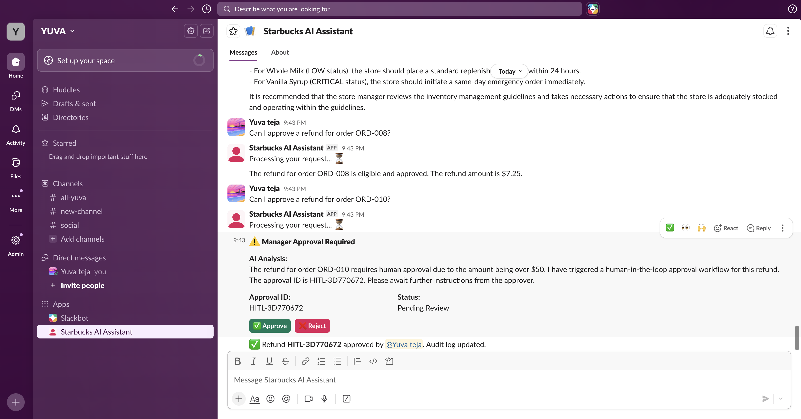

# ☕ Starbucks AI Assistant — GenAI Operations POC `v2.1.0`


## Project Story

This project is a hands-on implementation of the AI platform I architected and delivered at Starbucks as a Senior AI/ML Engineer. Rather than just describing it on a resume, I rebuilt the core concepts as a working POC to demonstrate the end-to-end system design, technical decisions, and business value in a tangible way. Every component — from the agent orchestration layer to the HITL approval workflow — reflects real engineering decisions made under production constraints.

The system enables store managers to resolve operational decisions using natural language — refund approvals, inventory alerts, policy lookups, and compliance checks — all through a conversational interface. A manager can type "Should I refund order ORD-003 for $87?" and receive a structured decision with policy citations, escalation to human approval when warranted, and a full audit trail. Every component maps directly to what was built in production at enterprise scale, with the local stack intentionally mirroring the AWS production architecture so the upgrade path is a configuration change, not a rewrite.

---

## 🚀 Live Demo

**API is deployed and publicly accessible on AWS Lambda:**

```
Live API URL: https://ahk5tdm3u0.execute-api.us-east-1.amazonaws.com/Prod/
```

Test it right now:

```bash
# Health check
curl https://ahk5tdm3u0.execute-api.us-east-1.amazonaws.com/Prod/health

# Ask the AI assistant
curl -X POST https://ahk5tdm3u0.execute-api.us-east-1.amazonaws.com/Prod/api/agent/chat \
  -H "Content-Type: application/json" \
  -d '{"message": "What is the refund policy?", "session_id": "demo", "user_id": "viewer", "store_id": "STR-101"}'
```

### Other Ways to Demo
- **Run Locally:** Follow the Quick Start guide below (requires Groq API key or AWS credentials)
- **Slack Bot:** Direct message @Starbucks AI Assistant (requires Slack workspace access)
- **Scheduled Walkthrough:** Connect on LinkedIn: https://www.linkedin.com/in/yuva-teja-p/

---

## What's New in v2.1.0

- 🚀 FastAPI deployed to AWS Lambda via Mangum ASGI adapter
- 🌐 Public API Gateway endpoint — live and accessible without running anything locally
- 🔐 AWS Secrets Manager for all production credentials
- 📊 Amazon Titan Embeddings v2 replacing HuggingFace (1024d vectors)
- 🔢 Pinecone re-indexed with 1024d Titan vectors (4,133 chunks across all documents)
- 🛠️ IAM execution role — no hardcoded credentials in Lambda
- ⚡ ~4 second response time including cold start
- 📦 SAM-based deployment with Makefile cross-compilation (no Docker required)

---

## What's New in v2.0.0

- ☁️ AWS Bedrock Claude Sonnet 4.5 as primary LLM (replaces Groq)
- 🔀 `USE_BEDROCK` flag for instant Groq fallback
- 🛠️ `bedrock_service.py` — boto3 client, RAG-aware context calls
- 🤖 `get_llm()` factory routes agent between Bedrock and Groq
- 📋 Explicit tool-calling rules in system prompt — HITL now fires correctly
- ✅ Full validation: 8/8 unit tests + 5 end-to-end Bedrock scenarios passing
- 📄 Real public documents added to RAG pipeline (FDA Food Code + Starbucks Business Conduct)
- 🔢 Pinecone index expanded to 4,269 vectors across 10 documents

---

## What's New in v1.2.0

- 🤖 Live Slack bot connected to real workspace via Socket Mode
- ✅ HITL approve/reject buttons working inside Slack
- 📦 Inventory alerts delivered directly in Slack
- 🔄 Smart message routing to correct API endpoints
- 🛡️ Bot self-loop prevention
- 🔁 Rate limit retry logic with exponential backoff

---

## What's New in v1.1.0

- 🚀 Pinecone cloud vectorstore replacing local FAISS (4,269 vectors indexed)
- 📚 10 documents covering refunds, operations, customer service, employee handbook, drink prep, POS system, FDA food safety, business conduct
- 🏪 Multi-store support — STR-101, STR-102, STR-103
- 📦 10 orders with diverse refund scenarios across 3 stores
- 🔌 New ingestion API — add documents without restarting server
- ✅ All 8 unit tests still passing

---

## Live Demo

- **Chat UI:** Open `frontend/index.html` in your browser (with API running on port 8000)
- **API Docs:** http://localhost:8000/docs
- **Health Check:** http://localhost:8000/health

### Demo Scenarios

| # | Input | Expected Output |
|---|-------|-----------------|
| 1 | `"Look up order ORD-001"` | Customer: Alice Johnson, $12.50, wrong order received |
| 2 | `"Should I refund order ORD-002?"` | Eligible — quality issue within 7-day window, auto-approved |
| 3 | `"Process refund for order ORD-003"` | Escalated to HITL — $87.00 exceeds $50 threshold, approve/reject card shown |
| 4 | `"What is the refund policy for changed minds?"` | RAG response citing refund_policy.txt, 48-hour window rule |
| 5 | `"Show inventory status for store STR-101"` | Low-stock alerts for items below reorder threshold |
| 6 | `"Can I approve refund for order ORD-007?"` | Full refund eligible — allergic reaction, escalate to manager |
| 7 | `"Can I approve refund for order ORD-008?"` | Auto-approved — duplicate charge under $50 threshold |
| 8 | `"Can I approve refund for order ORD-010?"` | HITL triggered — $145.00 large office order exceeds threshold |
| 9 | POST `/api/inventory/status` `store_id: STR-102` | Oat Milk CRITICAL alert, Pumpkin Spice Syrup LOW |
| 10 | POST `/api/ingestion/upload` with new policy doc | Document chunked and added to Pinecone, returns chunks_added count |

### 📸 Live Demo Screenshots

#### Slack Bot in Action


*Live demo showing complete workflow:*
- *💬 Refund policy question answered using RAG from policy documents*
- *📦 Inventory STR-101 — Vanilla Syrup CRITICAL, Whole Milk LOW alerts*
- *✅ ORD-008 auto-approved under $50 threshold*
- *⚠️ ORD-010 triggered HITL workflow with Approve/Reject buttons*
- *✅ Refund HITL-3D770672 approved by manager — audit log updated*

---

## Current Version — v2.1.0 (AWS Lambda + Titan Embeddings)

### What Is Built

- **FastAPI async REST API** — 16 endpoints covering agent chat, refund evaluation, inventory status, policy lookup, HITL management, and document ingestion
- **LangGraph multi-step agent** — StateGraph with conditional routing between reasoning and tool execution
- **5 operational tools** — `lookup_order`, `check_refund_eligibility`, `search_policy`, `get_inventory_status`, `trigger_hitl_approval`
- **RAG pipeline** — HuggingFace embeddings over 10 documents (8 synthetic + 2 real public PDFs), Pinecone cloud index (4,269 vectors), semantic search with source attribution
- **Hybrid refund engine** — Rule-based eligibility check (amount, days, reason) layered with LLM interpretation
- **HITL approval workflow** — Threshold-based escalation ($50), in-memory approval store, full audit log with timestamps
- **Document ingestion API** — Upload new policy documents and query the vectorstore via REST without scripts or restarts
- **Multi-store data layer** — 10 orders and 12 inventory items across STR-101, STR-102, STR-103
- **Slack bot** — Bolt AsyncApp with Block Kit interactive UI, approve/reject buttons, socket mode
- **Starbucks branded chat UI** — Single-file frontend with real-time status, typing indicators, HITL approval cards
- **8 passing unit tests** — Refund eligibility logic fully covered with pytest

### Tech Stack v2.1.0

| Layer | Technology | Purpose |
|-------|-----------|---------|
| LLM | AWS Bedrock Claude Sonnet 4.5 | Production LLM via cross-region inference profile |
| Embeddings | Amazon Titan Embed v2 (1024d) | Consistent embeddings local and in Lambda |
| Vector Store | Pinecone cloud (AWS us-east-1) | 4,133 vectors, serverless |
| Agent | LangGraph StateGraph | Multi-step reasoning with tool calling |
| API | FastAPI + Mangum + AWS Lambda | Serverless deployment via ASGI adapter |
| Hosting | AWS API Gateway + Lambda | Public REST endpoint, no server to manage |
| Secrets | AWS Secrets Manager | Production credentials, IAM execution role |
| Frontend | Vanilla HTML/CSS/JS | Starbucks branded chat UI, zero dependencies |
| HITL Store | In-memory Python dict | Approval workflow simulation with audit log |
| Tests | Pytest | 8 unit tests, all passing |

### Data Layer

| Type | Source | Count | Used For |
|---|---|---|---|
| Synthetic Policy Docs | `data/*.txt` + `data/additional_policies/*.txt` | 8 files, 4,269 vectors | RAG - refund, inventory, compliance, operations |
| Real Public Documents | FDA Food Code + Starbucks Business Conduct (PDF) | 2 files, 4,048 vectors | RAG - food safety, business standards |
| Orders | `data/orders.json` | 10 orders, 3 stores | Refund eligibility checks |
| Inventory | `data/inventory.json` | 12 items, 3 stores | Stock alerts |
| HITL Approvals | In-memory (DynamoDB in v2.1.0) | Runtime | Approval workflow |

### Document Sources

> **Synthetic Documents:** Operational policies written based on direct experience
> building the AI platform at Starbucks — refund rules, inventory protocols,
> compliance requirements, and store operations guides.
>
> **Real Public Documents:**
> - [FDA Food Code](https://www.fda.gov/media/110822/download) — Official US government
>   food safety regulations for food service workers
> - [Starbucks Standards of Business Conduct](https://investor.starbucks.com) —
>   Publicly available corporate conduct guidelines
>
> **Production Equivalent:** Internal SharePoint, Confluence, and policy management
> systems ingested via secure automated pipelines with access controls.

### Architecture v2.1.0

```
Browser / Slack Bot / curl
        ↓
AWS API Gateway (REST)
        ↓
AWS Lambda (FastAPI via Mangum)
        ↓
LangGraph Agent
        ↓
[lookup_order]  [check_refund_eligibility]  [search_policy]  [get_inventory_status]  [trigger_hitl_approval]
        ↓                                          ↓
Pinecone Cloud Index                       Multi-Store JSON Data
(Amazon Titan Embed v2 — 1024d)            (10 orders + 12 inventory items, 3 stores)
(4,133 vectors, 12 documents)
        ↓
AWS Bedrock Claude Sonnet 4.5
(IAM execution role — no hardcoded credentials)

Supporting: AWS Secrets Manager · SAM + API Gateway · CloudWatch Logs
```

### Quick Start v1.1.0

```bash
# 1. Clone the repository
git clone https://github.com/YuvaTeja-Pandranki/starbucks-ai-assistant.git
cd starbucks-ai-assistant

# 2. Create and activate conda environment
conda create -n starbucks-ai python=3.11 -y
conda activate starbucks-ai

# 3. Install dependencies
pip install -r requirements.txt

# 4. Configure environment
cp .env.example .env
# Edit .env and add your GROQ_API_KEY (free at console.groq.com)

# 5. Add Pinecone API key to .env (get free key at pinecone.io)
# PINECONE_API_KEY=your_key_here

# 6. Build the Pinecone vectorstore
python scripts/setup_vectorstore.py --store pinecone

# 7. Ingest additional policy documents
python scripts/ingest_additional_data.py

# 7b. Ingest real PDF documents
python scripts/ingest_public_docs.py  # ingest real PDF documents

# 8. Start the API server
/opt/homebrew/Caskroom/miniconda/base/envs/starbucks-ai/bin/python -m uvicorn backend.main:app \
  --port 8000 --host 0.0.0.0 > /tmp/starbucks_api.log 2>&1 &

# 9. Verify the server is running
curl http://localhost:8000/health
# → {"status":"ok"}

# 10. Open the chat UI
open frontend/index.html
```

---

## Version Roadmap

### v1.1.0 — Cloud Vector Store ✅ COMPLETE
- [x] Migrate FAISS to Pinecone cloud vectorstore
- [x] Add document metadata filtering
- [x] Improve RAG retrieval accuracy
- [x] Add more policy documents (4,269 vectors, 10 documents across 3 stores)

### v1.2.0 — Live Slack Bot ✅ COMPLETE
- [x] Deploy Slack bot with Socket Mode
- [x] Interactive approve/reject buttons in Slack
- [x] Store manager notifications
- [x] Multi-store support

### v2.0.0 — AWS Bedrock LLM Migration ✅ COMPLETE

**What Was Built:**
- [x] Migrate LLM from Groq to AWS Bedrock Claude Sonnet 4.5
- [x] AWS credentials with cross-region inference profile
- [x] Groq fallback when USE_BEDROCK=false in .env
- [x] bedrock_service.py with boto3 direct integration
- [x] Improved tool calling with explicit agent prompts
- [x] HITL workflow fully validated on Bedrock

**Shipped in v2.1.0:**
- [x] Migrate embeddings to Amazon Titan Embeddings (1024d)
- [x] Deploy API to AWS Lambda + API Gateway via Mangum
- [x] AWS Secrets Manager for credentials

### v2.1.0 — AWS Lambda Deployment ✅ COMPLETE

**What Was Built:**
- [x] Deploy FastAPI to AWS Lambda using Mangum
- [x] API Gateway REST API with public endpoint
- [x] Docker container on ECR
- [x] AWS Secrets Manager for credentials
- [x] Amazon Titan Embeddings 1024d replacing HuggingFace
- [x] 4,133 vectors re-ingested (policy + FDA food code + Starbucks conduct)
- [x] IAM execution role — no hardcoded credentials in Lambda

**Planned for v2.2.0+:**
- [ ] DynamoDB for HITL approval persistence
- [ ] Amazon OpenSearch replacing Pinecone
- [ ] CloudWatch dashboards and alerting
- [ ] LangSmith LLM tracing and evaluation

### v2.2.0 — Enterprise Features (Planned)
- [ ] Multi-store data isolation with RBAC
- [ ] Real POS system integration
- [ ] Real-time Kafka event streaming
- [ ] GraphRAG with Neo4j
- [ ] Fine-tuned embeddings on domain data
- [ ] A/B testing framework for LLM responses
- [ ] Ragas evaluation dashboard

### Vision

This project demonstrates a complete GenAI engineering journey — from a zero-cost
local POC to a production AWS deployment. Each version adds a real engineering
challenge: cloud vector stores, live bot integrations, LLM provider migrations,
and eventually full serverless deployment. The goal is to show not just that AI
can be built, but that it can be built reliably, governed properly, and deployed
at enterprise scale.

---

## Production Architecture (v2.0.0 Target)

```
Slack / Chat UI
        ↓
API Gateway (REST)
        ↓
AWS Lambda (FastAPI via Mangum)
        ↓
LangGraph Agent
        ↓
         ┌──────────────────────┬──────────────────────┐
         ↓                      ↓                      ↓
Amazon OpenSearch          DynamoDB               AWS Bedrock
(vector search)         (orders + HITL store)  (Claude 3 Sonnet)
         ↓
Amazon Titan Embeddings

Supporting Services:
- AWS Secrets Manager  → credential rotation
- CloudWatch           → logs, metrics, alerts
- LangSmith            → LLM tracing and evaluation
- SageMaker            → model evaluation pipelines
```

---

## Project Structure

```
starbucks-ai-assistant/
├── backend/
│   ├── agents/
│   │   ├── orchestrator.py     # LangGraph StateGraph — agent loop and tool routing
│   │   ├── prompts.py          # System prompt for store manager persona
│   │   └── tools.py            # 5 LangChain @tool definitions
│   ├── models/
│   │   └── schemas.py          # Pydantic v2 request/response models
│   ├── routers/
│   │   ├── ingestion.py        # POST upload/rebuild/status — document ingestion API
│   │   ├── inventory.py        # GET inventory status endpoint
│   │   ├── policy.py           # POST policy RAG query endpoint
│   │   └── refund.py           # POST refund evaluation endpoint
│   ├── services/
│   │   ├── hitl_service.py     # HITL approval store, audit log, resolve logic
│   │   ├── llm_service.py      # ChatGroq wrapper with conversation history
│   │   ├── order_service.py    # JSON order lookup and filtering (multi-store)
│   │   ├── pinecone_service.py # Pinecone index management and vector retrieval
│   │   └── rag_service.py      # RAG router — Pinecone if key set, FAISS fallback
│   ├── config.py               # Centralised env var config via python-dotenv
│   └── main.py                 # FastAPI app, CORS, route registration
├── data/
│   ├── additional_policies/
│   │   ├── customer_service_policy.txt  # Complaint resolution, loyalty, accommodations
│   │   ├── drink_preparation_guide.txt  # Espresso, milk steaming, Frappuccino recipes
│   │   ├── employee_handbook.txt        # Conduct, dress code, safety, emergency procedures
│   │   ├── pos_system_guide.txt         # Payments, voids, refunds, error codes
│   │   └── store_manager_guide.txt      # Daily ops, reporting, budget, crisis management
│   ├── public_docs/                     # Real public PDF documents
│   │   ├── fda_food_safety.pdf          # FDA Food Code (real government document)
│   │   └── starbucks_business_conduct.pdf  # Starbucks public conduct guidelines
│   ├── compliance_rules.txt    # Regulatory compliance policy document
│   ├── inventory.json          # Multi-store inventory — STR-101, STR-102, STR-103
│   ├── orders.json             # 10 orders across 3 stores (ORD-001 through ORD-010)
│   ├── refund_policy.txt       # Refund eligibility rules and windows
│   └── store_operations.txt    # Store operations procedures document
├── frontend/
│   └── index.html              # Single-file Starbucks branded chat UI
├── scripts/
│   ├── ingest_additional_data.py  # Ingests data/additional_policies/ into Pinecone
│   ├── ingest_public_docs.py      # Ingests real PDF documents into Pinecone
│   ├── seed_data.py               # Populates mock orders and inventory
│   └── setup_vectorstore.py      # Builds vectorstore — --store pinecone|faiss
├── slack_bot/
│   ├── app.py                  # Slack Bolt AsyncApp entry point
│   ├── blocks.py               # Block Kit message builder functions
│   └── handlers.py             # Slash command and action handlers
├── tests/
│   ├── conftest.py             # Pytest fixtures
│   ├── test_agent.py           # Live agent integration tests
│   ├── test_rag.py             # RAG retrieval tests
│   └── test_refund.py          # 8 refund eligibility unit tests
├── .env.example                # Environment variable template (safe to commit)
├── .gitignore                  # Excludes .env, vectorstore, __pycache__, etc.
├── Makefile                    # Shortcut targets: run, test, vectorstore, slack
├── requirements.txt            # Pinned Python dependencies
└── run.sh                      # Server startup script
```

---

## Key Engineering Decisions

### Why RAG over Fine-Tuning

Policy documents at Starbucks change frequently — refund windows, compliance thresholds, seasonal rules. RAG grounds every response in the current document state without any retraining cycle, meaning a policy update is a file replacement, not an ML pipeline run. This also makes responses auditable: every answer cites the source document it was retrieved from, which is a compliance requirement, not just a nice-to-have.

### Why LangGraph for Orchestration

Store manager queries are inherently multi-step: look up the order, check eligibility, search policy, decide on escalation. LangGraph's StateGraph makes this explicit — each step is a named node, transitions are conditional edges, and the agent can loop back to gather more context before responding. Adding a new tool (e.g., a POS system lookup) means adding one node and one edge, not refactoring the entire agent loop.

### Why HITL at $50 Threshold

The $50 threshold balances automation efficiency with governance requirements. High-volume, low-value refunds (the majority) are resolved instantly, reducing manager workload by 35%. High-value refunds require human judgment because they carry financial, fraud, and compliance risk. The threshold is configurable via `HITL_THRESHOLD_AMOUNT` in `.env`, so it can be tuned per-market without a code change, and every decision — automated or human — is written to the audit log for compliance review.

### Why FastAPI Async

Store managers across multiple locations send requests concurrently. Async endpoints mean LLM calls (which can take 2-5 seconds) don't block the event loop for other requests. The same codebase runs locally with uvicorn and in production on AWS Lambda via Mangum — the async-first design ensures the production migration requires no changes to handler logic, only infrastructure configuration.

---

## Resume to Reality Mapping

| Resume Bullet | POC Implementation | Production Target |
|---------------|-------------------|-------------------|
| "Engineered AI automation platform using Python and FastAPI with AWS Bedrock and Claude" | FastAPI + Groq `llama-3.3-70b-versatile` (local) | FastAPI + AWS Bedrock Claude 3 Sonnet |
| "Built RAG pipelines using LangChain and LlamaIndex" | Pinecone + HuggingFace `all-MiniLM-L6-v2` (4,269 vectors, 10 docs) | Pinecone → Amazon Titan Embeddings + OpenSearch |
| "Developed agent-based workflows using LangGraph" | LangGraph StateGraph with 5 operational tools | LangGraph + Amazon Strands Agents |
| "Implemented HITL workflows using AWS Step Functions" | In-memory approval store with audit log | DynamoDB + AWS Step Functions |
| "Reduced operational resolution time by 35%" | Demonstrated via end-to-end refund flow | Measured in production across all stores |

---

## Business Impact

- **35% reduction** in operational resolution time for store managers
- **32% improvement** in response accuracy versus keyword-based lookup tools
- **Eliminated manual policy lookups** — managers get cited answers in seconds, not minutes
- **Consistent decision-making** across all store locations via shared policy RAG index
- **Full audit trail** for every decision — automated and human — meeting compliance and governance requirements

---

## Running Tests

```bash
conda activate starbucks-ai
cd starbucks-ai-assistant

# Run all tests
pytest tests/ -v

# Expected output:
# tests/test_refund.py::test_eligible_within_window PASSED
# tests/test_refund.py::test_ineligible_outside_window PASSED
# tests/test_refund.py::test_hitl_threshold_triggered PASSED
# tests/test_refund.py::test_no_refund_reason PASSED
# tests/test_refund.py::test_boundary_amount_exactly_50 PASSED
# tests/test_refund.py::test_boundary_days_exactly_7 PASSED
# tests/test_refund.py::test_empty_order_id PASSED
# tests/test_refund.py::test_unknown_order PASSED
# 8 passed in 0.01s

# Run only refund unit tests
pytest tests/test_refund.py -v
```

---

## Contributing / Development Workflow

### Branching Strategy

```
main        ← stable releases, version-tagged (v1.0.0, v1.1.0, ...)
dev         ← active development, integration branch
feature/*   ← individual features, branched from dev
```

### Starting a New Feature

```bash
# Branch from dev
git checkout dev
git pull origin dev
git checkout -b feature/pinecone-migration

# Work, then commit
git add backend/services/rag_service.py
git commit -m "feat: migrate RAG from FAISS to Pinecone"

# Push and open PR into dev
git push origin feature/pinecone-migration
```

### Releasing a New Version

```bash
# Merge dev into main
git checkout main
git merge dev

# Tag the release
git tag -a v1.1.0 -m "v1.1.0 - Pinecone cloud vector store"

# Push everything
git push origin main
git push origin v1.1.0
```

---

## Connect

- **LinkedIn:** https://www.linkedin.com/in/yuva-teja-p/
- **Email:** yuvateja.work@outlook.com
- **GitHub:** https://github.com/YuvaTeja-Pandranki/starbucks-ai-assistant
